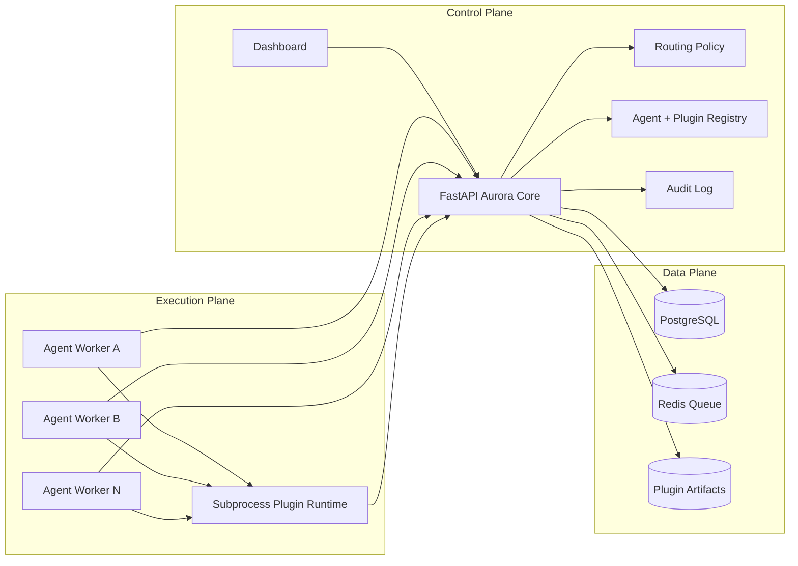
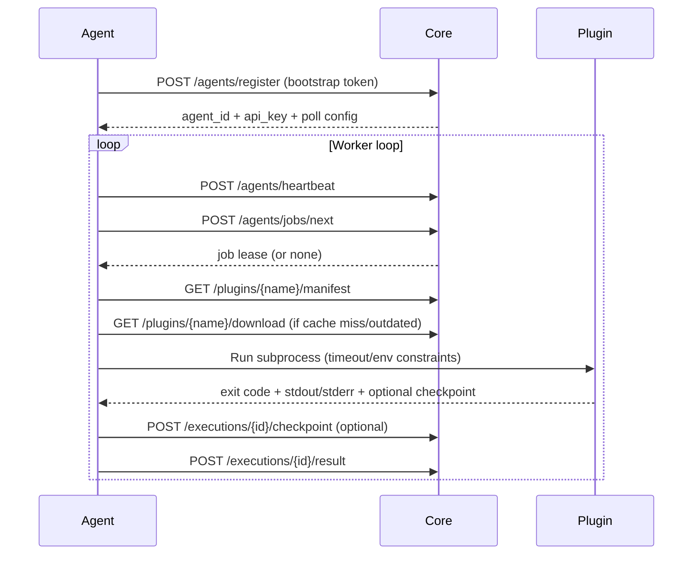

# Project Aurora

Aurora is a distributed job orchestration platform that executes versioned plugins across pull-based worker agents. It is built for reliable execution, observability, and controlled operations from a centralized dashboard.

## Why This Project Matters

- Reliability first: lease-based dispatch, retries, backoff, and stale-lease recovery.
- Long-running job support: checkpoint/resume so work does not restart from zero.
- Safe execution model: plugins run as subprocesses with timeout, exit-code, and output capture.
- Operational visibility: live dashboard, progression feed, and audit logs for important actions.
- Extensible foundation: deterministic routing today, strategy interface for future policy engines.

## Architecture



## Execution Lifecycle



## Core Features

- Agent onboarding and identity
  - `POST /agents/register`
  - `POST /agents/heartbeat`
- Pull-based leasing and queue orchestration
  - `POST /agents/jobs/next`
- Plugin registry and artifact delivery
  - `POST /plugins/register`
  - `GET /plugins/{name}/manifest`
  - `GET /plugins/{name}/download`
- Execution intake and progress tracking
  - `POST /executions/{id}/result`
  - `POST /executions/{id}/checkpoint`
  - `GET /executions/{id}/checkpoint/latest`
  - `GET /jobs/{id}/progress`
- Dashboard and operations
  - `GET /login`
  - `GET /dashboard`
  - `GET /dashboard/api/overview`
- Superadmin operations
  - `POST /superadmin/users`
  - `GET /superadmin/audit/logs`
  - `POST /superadmin/backups/create`
  - `GET /superadmin/backups`
  - `POST /superadmin/backups/{id}/validate`
  - `POST /superadmin/backups/prune`
  - `POST /superadmin/backups/{id}/restore?dry_run=true`
  - `POST /superadmin/backups/{id}/restore?dry_run=false` with confirmation body
  - `POST /superadmin/backups/{id}/offsite-sync`
  - `GET /superadmin/backups/{id}/manifest/download`
  - `GET /superadmin/backups/policy`
  - `GET /superadmin/backups/health`
  - `GET /superadmin/audit/logs/export`
  - `POST /superadmin/debug/enqueue-random` (temporary test helper)

## Security Model (MVP)

- Agent API auth: `X-Agent-Id` + `X-Agent-Key`
- Admin API auth: `X-Admin-Token`
- Dashboard auth: `/login` session cookie
- RBAC roles: `operator`, `admin`, `superadmin`
- Audit logging for important actions (auth, user creation, plugin/job operations)
- During restore apply, Aurora enters maintenance mode and write endpoints return `503`.

## Technology Stack

- API: FastAPI
- ORM and migrations: SQLAlchemy + Alembic
- Durable state: PostgreSQL
- Dispatch queue: Redis (with in-memory adapter for tests)
- Worker runtime: Python subprocess execution model
- Frontend: server-rendered dashboard HTML/CSS/JS
- Dev runtime: Docker Compose + PowerShell helper scripts

## Repository Layout

- `aurora_core/` - orchestration API, routing, dashboard endpoints, auth
- `aurora_agent/` - polling worker runtime and plugin execution loop
- `plugins/` - plugin artifacts served by core
- `migrations/` - Alembic migration history
- `tests/` - unit, contract, and integration tests
- `scripts/` - run/restart/stop and backup helper scripts
- `docs/TOKEN_EFFICIENT_WORKFLOW_RULES.md` - default low-token collaboration rules
- `docs/LARGE_FILE_SLICING_PLAYBOOK.md` - safe modularization plan for large files

## Quick Start

### 1. Install

```bash
pip install -e .[dev]
```

### 2. Start Everything (Windows PowerShell)

Default startup (recommended): starts Docker, applies migrations, then starts Core + Agent.

```powershell
.\scripts\run_all.ps1
```

Force restart both:

```powershell
.\scripts\run_all.ps1 -RestartExisting
```

Skip migration one time (only if you are sure schema is already correct):

```powershell
.\scripts\run_all.ps1 -SkipMigrate
```

Restart only Core:

```powershell
.\scripts\restart_core.ps1
```

Stop all services:

```powershell
.\scripts\stop_all.ps1
```

Backup helpers:

```powershell
.\scripts\backup_now.ps1
.\scripts\list_backups.ps1
.\scripts\prune_backups.ps1
.\scripts\restore_backup.ps1 -BackupId bkp_xxx
.\scripts\sync_backup_offsite.ps1 -BackupId bkp_xxx
```

Apply restore (non-dry-run):

```powershell
.\scripts\restore_backup.ps1 -BackupId bkp_xxx -Apply
```

### 3. Open Dashboard

- `http://127.0.0.1:8000/login`
- default bootstrap superadmin credentials:
  - username: `superadmin`
  - password: `superadmin`

Set production credentials with environment variables:

- `AURORA_SUPERADMIN_USERNAME`
- `AURORA_SUPERADMIN_PASSWORD`
- `AURORA_BACKUP_DIR`
- `AURORA_BACKUP_MAX_STORAGE_GB`
- `AURORA_BACKUP_RETENTION_DAILY`
- `AURORA_BACKUP_RETENTION_WEEKLY`
- `AURORA_BACKUP_RETENTION_MONTHLY`
- `AURORA_BACKUP_OFFSITE_DIR`
- `AURORA_BACKUP_SCHEDULER_ENABLED`
- `AURORA_BACKUP_SCHEDULE_CREATE_MINUTES`
- `AURORA_BACKUP_SCHEDULE_VALIDATE_MINUTES`
- `AURORA_BACKUP_SCHEDULE_PRUNE_MINUTES`
- `AURORA_BACKUP_SCHEDULE_RESTORE_DRILL_MINUTES`
- `AURORA_BACKUP_VALIDATE_AFTER_CREATE`
- `AURORA_BACKUP_PRUNE_MIN_KEEP_COUNT`
- `AURORA_SCHEMA_AUTO_REPAIR_ON_STARTUP` (default `true`)

### 4. Demo One End-to-End Job

Register plugin:

```bash
curl -X POST http://127.0.0.1:8000/plugins/register \
  -H "X-Admin-Token: aurora-admin-token" \
  -H "Content-Type: application/json" \
  -d '{"name":"echo","version":"1.0.0","filename":"echo_plugin.py","timeout_seconds":5}'
```

Enqueue job:

```bash
curl -X POST http://127.0.0.1:8000/jobs \
  -H "X-Admin-Token: aurora-admin-token" \
  -H "Content-Type: application/json" \
  -d '{"plugin_name":"echo","plugin_version":"1.0.0","payload":{"message":"hello"},"required_tags":["default"]}'
```

Watch live updates on dashboard cards, progression feed, agent status, and latest logs.

## Checkpoint/Resume Contract

For long-running plugins:

- Agent provides `AURORA_CHECKPOINT_PATH` for plugin to persist JSON state.
- Agent provides `AURORA_RESUME_CHECKPOINT` with latest known JSON checkpoint.
- Core stores checkpoint snapshots and exposes latest progress to APIs/dashboard.

## Test Strategy

- Contract tests: schema and status code behavior, including auth failures.
- Queue/lease tests: single lease ownership and stale lease handling.
- Failure tests: timeout, non-zero exit, retry/backoff behavior.
- Integration tests: Core + Redis + Postgres + Agent end-to-end lifecycle.

Run unit/contract tests:

```bash
pytest tests/unit -q
```

Run integration tests (with services running):

```bash
set AURORA_INTEGRATION_BASE_URL=http://127.0.0.1:8000
pytest tests/integration -q
```

## Troubleshooting

### Safe Deploy Checklist

```powershell
pip install -e .[dev]
.\scripts\run_all.ps1 -RestartExisting
```

### Agent register returns 500 after pull/update

Symptom in logs:

- core: `ProgrammingError ... column "cpu_load_pct" of relation "agents" does not exist`
- agent: repeated `500 Server Error ... /agents/register`

Cause:

- database schema behind code (new migration not applied).

Fix:

```powershell
alembic upgrade head
.\scripts\run_all.ps1 -RestartExisting
```

If needed, check migration state:

```powershell
alembic current
alembic history --verbose
```

### Startup fails due to migration drift

Aurora now checks DB revision at startup. If schema is behind, it will try to auto-repair:

- migrate to head when `alembic_version` exists but is behind
- infer/stamp revision when legacy tables exist without `alembic_version`, then migrate

If recovery still fails:

```powershell
alembic current
alembic history --verbose
.\scripts\migrate_and_restart.ps1
```

### Backup reliability defaults

- Backup create now validates checksum immediately by default.
- Offsite copy runs only after a valid backup.
- Prune keeps a minimum recovery floor and avoids pruning the last validated backup.

## Engineering Tradeoffs

- Pull model over push model
  - Simpler firewall/network posture and easier horizontal scaling.
- Static deterministic routing for MVP
  - Predictable behavior first, pluggable strategy interface for future policies.
- Subprocess plugin runtime
  - Better fault isolation than in-process execution at MVP complexity level.
- Single-core deployment initially
  - Faster delivery and validation; HA planned for later phase.

## Roadmap

- Backup and rollback system for core data/state.
- Click-through dashboard drilldowns per card/panel.
- Superadmin tools expansion (policy controls, operational guardrails).
- High-availability core deployment model.
- Optional LLM plugin class when budget/ops constraints allow.

## Project Status

Aurora is in MVP-plus phase: end-to-end orchestration is live, dashboard operations are functional, and the system is being hardened for production-oriented workflows.
