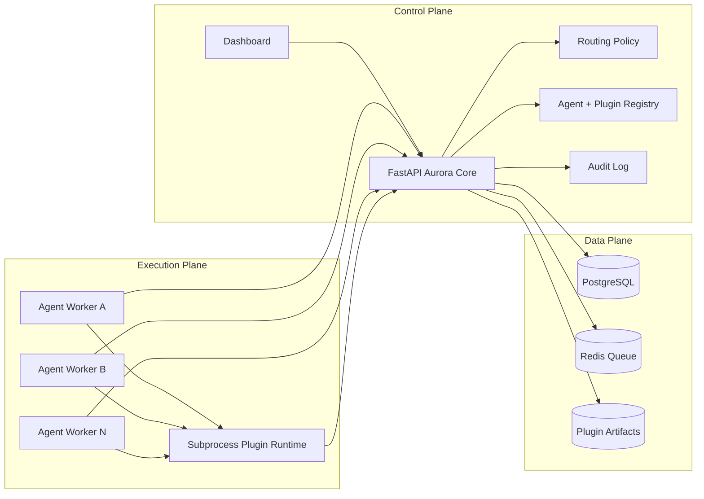
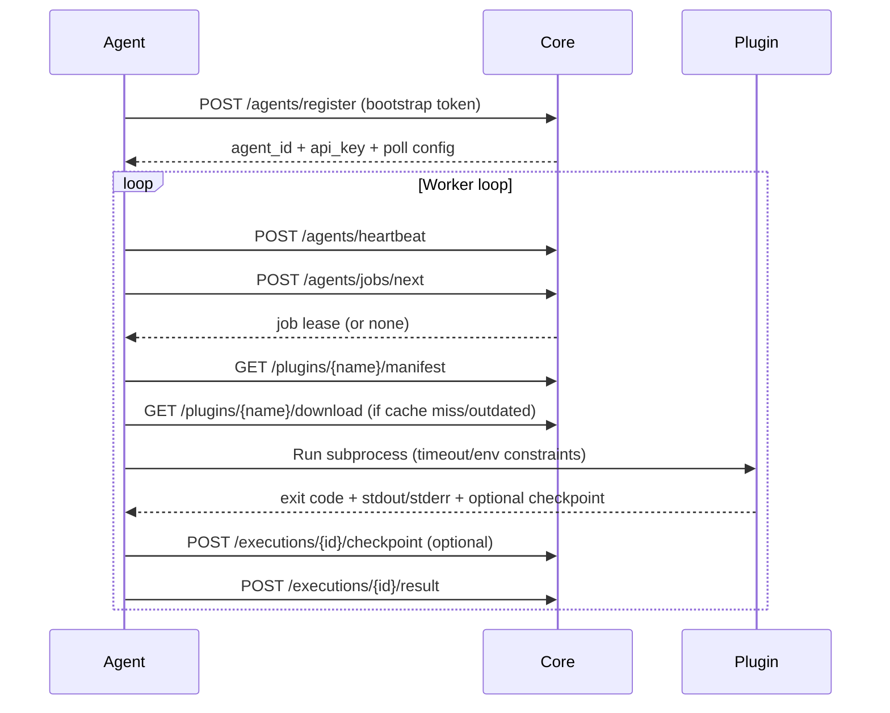

# Project Aurora

Aurora is a distributed job orchestration platform that executes versioned plugins across pull-based worker agents. It is built for reliable execution, observability, and controlled operations from a centralized dashboard.

**Highlights**

- Distributed worker orchestration
- Checkpoint & resume
- Fault-tolerant execution
- Plugin runtime
- Operational dashboard
- Backup & recovery
- LLM plugin prototype with allowlisted read-only runtime actions

## Why This Project Matters

- Reliability first: lease-based dispatch, retries, backoff, and stale-lease recovery.
- Long-running job support: checkpoint/resume so work does not restart from zero.
- Safe execution model: plugins run as subprocesses with timeout, exit-code, and output capture.
- Operational visibility: live dashboard, progression feed, and audit logs for important actions.
- LLM path: command metadata retrieval, structured responses, and audit-backed read-only runtime execution.
- Extensible foundation: deterministic routing today, strategy interface for future policy engines.

## Architecture


```mermaid
flowchart LR
    subgraph Control Plane
      UI[Dashboard]
      CORE[FastAPI Aurora Core]
      ROUTER[Routing Policy]
      REG[Agent + Plugin Registry]
      AUDIT[Audit Log]
    end

    subgraph Data Plane
      PG[(PostgreSQL)]
      RQ[(Redis Queue)]
      PLUGINS[(Plugin Artifacts)]
    end

    subgraph Execution Plane
      A1[Agent Worker A]
      A2[Agent Worker B]
      AN[Agent Worker N]
      EXE[Subprocess Plugin Runtime]
    end

    UI --> CORE
    CORE --> ROUTER
    CORE --> REG
    CORE --> PG
    CORE --> RQ
    CORE --> PLUGINS

    A1 --> CORE
    A2 --> CORE
    AN --> CORE

    A1 --> EXE
    A2 --> EXE
    AN --> EXE

    EXE --> CORE
    CORE --> AUDIT
```

## Execution Lifecycle


```mermaid
sequenceDiagram
    participant Agent
    participant Core
    participant Plugin

    Agent->>Core: POST /agents/register (bootstrap token)
    Core-->>Agent: agent_id + api_key + poll config

    loop Worker loop
        Agent->>Core: POST /agents/heartbeat
        Agent->>Core: POST /agents/jobs/next
        Core-->>Agent: job lease (or none)

        Agent->>Core: GET /plugins/{name}/manifest
        Agent->>Core: GET /plugins/{name}/download (if cache miss/outdated)

        Agent->>Plugin: Run subprocess (timeout/env constraints)
        Plugin-->>Agent: exit code + stdout/stderr + optional checkpoint

        Agent->>Core: POST /executions/{id}/checkpoint (optional)
        Agent->>Core: POST /executions/{id}/result
    end
```

## Core Features

- Agent onboarding and identity
  - `POST /agents/register`
  - `POST /agents/heartbeat`
- Pull-based leasing and queue orchestration
  - `POST /agents/jobs/next`
- Plugin registry and artifact delivery
  - `POST /plugins/register`
  - `GET /plugins/{name}/manifest`
  - `GET /plugins/{name}/download`
- Execution intake and progress tracking
  - `POST /executions/{id}/result`
  - `POST /executions/{id}/checkpoint`
  - `GET /executions/{id}/checkpoint/latest`
  - `GET /jobs/{id}/progress`
- Dashboard and operations
  - `GET /login`
  - `GET /dashboard`
  - `GET /dashboard/api/overview`
  - `GET /health`
  - `GET /health/ready`
- Runtime read-only summary endpoints used by the LLM worker
  - `GET /agents/runtime/overview`
- Runtime audit endpoint used by the LLM worker
  - `POST /agents/runtime/audit`
- Superadmin operations
  - `POST /superadmin/users`
  - `GET /superadmin/audit/logs`
  - `POST /superadmin/backups/create`
  - `GET /superadmin/backups`
  - `POST /superadmin/backups/{id}/validate`
  - `POST /superadmin/backups/prune`
  - `POST /superadmin/backups/{id}/restore?dry_run=true`
  - `POST /superadmin/backups/{id}/restore?dry_run=false` with confirmation body + confirmation token
  - `POST /superadmin/confirmations` (issue short-lived confirmation token for destructive actions)
  - `POST /superadmin/backups/{id}/offsite-sync`
  - `GET /superadmin/backups/{id}/manifest/download`
  - `GET /superadmin/backups/policy`
  - `GET /superadmin/backups/health`
  - `GET /superadmin/audit/logs/export`
  - `POST /superadmin/debug/enqueue-random` (temporary test helper)

## Security Model (MVP)

- Agent API auth: `X-Agent-Id` + `X-Agent-Key`
- Admin API auth: `X-Admin-Token`
- Dashboard auth: `/login` session cookie
- Dashboard cookie security: `Secure` is enabled automatically outside `dev/local/test`
- RBAC roles: `operator`, `admin`, `superadmin`
- Audit logging for important actions (auth, user creation, plugin/job operations)
- During restore apply, Aurora enters maintenance mode and write endpoints return `503`.
- Optional rate limiting (local-first):
  - login attempts (`/login`)
  - admin-token write endpoints (`X-Admin-Token` protected routes)

## Technology Stack

- API: FastAPI
- ORM and migrations: SQLAlchemy + Alembic
- Durable state: PostgreSQL
- Dispatch queue: Redis (with in-memory adapter for tests)
- Worker runtime: Python subprocess execution model
- Frontend: server-rendered dashboard HTML/CSS/JS
- Dev runtime: Docker Compose + PowerShell helper scripts

## Repository Layout

- `aurora_core/main.py` - app bootstrap, lifespan, and router registration
- `aurora_core/config.py` - settings model and environment binding
- `aurora_core/db.py` - SQLAlchemy session factory wiring
- `aurora_core/routes/` - domain route modules (`auth`, `operations`, `dashboard`, `superadmin`)
- `aurora_core/services/` - business/domain services, models, schemas, auth/security, queue/routing
- `aurora_core/utils/` - shared utility helpers
- `aurora_agent/` - polling worker runtime and plugin execution loop
- `plugins/` - plugin artifacts served by core
- `migrations/` - Alembic migration history
- `tests/` - unit, contract, and integration tests
- `scripts/` - run/restart/stop and backup helper scripts
- `docs/workflow.agent.MD` - default low-token collaboration rules
- `docs/slicing.agent.MD` - safe modularization plan for large files

## Quick Start

### 1. Install

```bash
python -m pip install -e ".[dev]"
```

### 2. Start Everything (Windows PowerShell)

Default startup (recommended): starts Docker, applies migrations, then starts Core + Agent.

```powershell
.\scripts\run_all.ps1
```

Force restart both:

```powershell
.\scripts\run_all.ps1 -RestartExisting
```

Skip migration one time (only if you are sure schema is already correct):

```powershell
.\scripts\run_all.ps1 -SkipMigrate
```

Restart only Core:

```powershell
.\scripts\restart_core.ps1
```

Stop all services:

```powershell
.\scripts\stop_all.ps1
```

Backup helpers:

```powershell
.\scripts\backup_now.ps1
.\scripts\list_backups.ps1
.\scripts\prune_backups.ps1
.\scripts\restore_backup.ps1 -BackupId bkp_xxx
.\scripts\sync_backup_offsite.ps1 -BackupId bkp_xxx
```

Apply restore (non-dry-run):

```powershell
.\scripts\restore_backup.ps1 -BackupId bkp_xxx -Apply
```

### Restore Runbook (Operator)

1. Validate backup first:

```powershell
.\scripts\restore_backup.ps1 -BackupId bkp_xxx
```

2. Run API dry-run from dashboard (`Test restore`) or endpoint:

```bash
curl -X POST "http://127.0.0.1:8000/superadmin/backups/bkp_xxx/restore?dry_run=true" \
  -H "X-Admin-Token: aurora-admin-token"
```

3. Issue a confirmation token for restore apply:

```bash
curl -X POST "http://127.0.0.1:8000/superadmin/confirmations" \
  -H "Content-Type: application/json" \
  -b "aurora_dashboard_session=<session_cookie>" \
  -d '{"action":"backup.restore.apply","backup_id":"bkp_xxx"}'
```

4. Confirm apply (requires backup id + short-lived confirmation token):

```bash
curl -X POST "http://127.0.0.1:8000/superadmin/backups/bkp_xxx/restore?dry_run=false" \
  -H "X-Admin-Token: aurora-admin-token" \
  -H "Content-Type: application/json" \
  -d '{"confirm":"bkp_xxx","confirm_token":"cfm_xxx"}'
```

5. Post-restore checks:
- Open dashboard and verify agent/task counters load normally.
- Verify latest backup summary and audit log entries are present.
- Run a smoke task (`/superadmin/debug/enqueue-random`) and confirm completion.

### 3. Open Dashboard

- `http://127.0.0.1:8000/login`
- default bootstrap superadmin credentials:
  - username: `superadmin`
  - password: `superadmin`

Set production credentials with environment variables:

- `AURORA_ADMIN_TOKEN`
- `AURORA_BOOTSTRAP_TOKEN`
- `AURORA_SUPERADMIN_USERNAME`
- `AURORA_SUPERADMIN_PASSWORD`
- `AURORA_BACKUP_DIR`
- `AURORA_BACKUP_MAX_STORAGE_GB`
- `AURORA_BACKUP_RETENTION_DAILY`
- `AURORA_BACKUP_RETENTION_WEEKLY`
- `AURORA_BACKUP_RETENTION_MONTHLY`
- `AURORA_BACKUP_OFFSITE_DIR`
- `AURORA_BACKUP_SCHEDULER_ENABLED`
- `AURORA_BACKUP_SCHEDULE_CREATE_MINUTES`
- `AURORA_BACKUP_SCHEDULE_VALIDATE_MINUTES`
- `AURORA_BACKUP_SCHEDULE_PRUNE_MINUTES`
- `AURORA_BACKUP_SCHEDULE_RESTORE_DRILL_MINUTES`
- `AURORA_BACKUP_VALIDATE_AFTER_CREATE`
- `AURORA_BACKUP_PRUNE_MIN_KEEP_COUNT`
- `AURORA_SCHEMA_AUTO_REPAIR_ON_STARTUP` (default `true`)
- `AURORA_LOGIN_RATE_LIMIT_ENABLED` (default `false`)
- `AURORA_LOGIN_RATE_LIMIT_MAX_ATTEMPTS`
- `AURORA_LOGIN_RATE_LIMIT_WINDOW_SECONDS`
- `AURORA_TOKEN_RATE_LIMIT_ENABLED` (default `false`)
- `AURORA_TOKEN_RATE_LIMIT_MAX_ATTEMPTS`
- `AURORA_TOKEN_RATE_LIMIT_WINDOW_SECONDS`
- `AURORA_IDEMPOTENCY_TTL_SECONDS`
- `AURORA_DESTRUCTIVE_ACTION_TOKEN_TTL_SECONDS`

Production startup security checks:

- `AURORA_SUPERADMIN_USERNAME` / `AURORA_SUPERADMIN_PASSWORD` must not be default `superadmin/superadmin`
- `AURORA_ADMIN_TOKEN` must not be default `aurora-admin-token`
- `AURORA_BOOTSTRAP_TOKEN` must not be default `aurora-bootstrap-token`
- minimum lengths in production:
  - superadmin password: at least 12 characters
  - admin token: at least 20 characters
  - bootstrap token: at least 20 characters

### 4. Demo One End-to-End Job

Register plugin:

```bash
curl -X POST http://127.0.0.1:8000/plugins/register \
  -H "X-Admin-Token: aurora-admin-token" \
  -H "Content-Type: application/json" \
  -d '{"name":"echo","version":"1.0.0","filename":"echo_plugin.py","timeout_seconds":5}'
```

Enqueue job:

```bash
curl -X POST http://127.0.0.1:8000/jobs \
  -H "X-Admin-Token: aurora-admin-token" \
  -H "Idempotency-Key: idem-job-001" \
  -H "Content-Type: application/json" \
  -d '{"plugin_name":"echo","plugin_version":"1.0.0","payload":{"message":"hello"},"required_tags":["default"]}'
```

Watch live updates on dashboard cards, progression feed, agent status, and latest logs.

Idempotency behavior:

- `Idempotency-Key` is supported on:
  - `POST /jobs`
  - `POST /plugins/register`
- Same key + same payload -> response replayed.
- Same key + different payload -> `409 Conflict`.

## Checkpoint/Resume Contract

For long-running plugins:

- Agent provides `AURORA_CHECKPOINT_PATH` for plugin to persist JSON state.
- Agent provides `AURORA_RESUME_CHECKPOINT` with latest known JSON checkpoint.
- Core stores checkpoint snapshots and exposes latest progress to APIs/dashboard.

## Test Strategy

- Contract tests: schema and status code behavior, including auth failures.
- Queue/lease tests: single lease ownership and stale lease handling.
- Failure tests: timeout, non-zero exit, retry/backoff behavior.
- Integration tests: Core + Redis + Postgres + Agent end-to-end lifecycle.

Run unit/contract tests:

```bash
pytest tests/unit -q
```

Run integration tests (with services running):

```bash
set AURORA_INTEGRATION_BASE_URL=http://127.0.0.1:8000
pytest tests/integration -q
```

## Troubleshooting

### Safe Deploy Checklist

```powershell
pip install -e .[dev]
.\scripts\run_all.ps1 -RestartExisting
```

### Agent register returns 500 after pull/update

Symptom in logs:

- core: `ProgrammingError ... column "cpu_load_pct" of relation "agents" does not exist`
- agent: repeated `500 Server Error ... /agents/register`

Cause:

- database schema behind code (new migration not applied).

Fix:

```powershell
alembic upgrade head
.\scripts\run_all.ps1 -RestartExisting
```

If needed, check migration state:

```powershell
alembic current
alembic history --verbose
```

### Startup fails due to migration drift

Aurora now checks DB revision at startup. If schema is behind, it will try to auto-repair:

- migrate to head when `alembic_version` exists but is behind
- infer/stamp revision when legacy tables exist without `alembic_version`, then migrate

If recovery still fails:

```powershell
alembic current
alembic history --verbose
.\scripts\migrate_and_restart.ps1
```

### Backup reliability defaults

- Backup create now validates checksum immediately by default.
- Offsite copy runs only after a valid backup.
- Prune keeps a minimum recovery floor and avoids pruning the last validated backup.

### Health and readiness

- `GET /health` is shallow liveness.
- `GET /health/ready` returns component readiness for:
  - database
  - queue adapter
  - schema guard mode
  - backup scheduler state
- `GET /agents/runtime/overview` returns a bounded read-only runtime summary for the authenticated agent.
- `POST /agents/runtime/audit` records runtime plan/start/completion/rejection events in the audit log.
- `503` is returned when one or more readiness components are degraded.

## Engineering Tradeoffs

- Pull model over push model
  - Simpler firewall/network posture and easier horizontal scaling.
- Static deterministic routing for MVP
  - Predictable behavior first, pluggable strategy interface for future policies.
- Subprocess plugin runtime
  - Better fault isolation than in-process execution at MVP complexity level.
- Allowlisted read-only LLM runtime actions
  - Keeps runtime execution explicit, bounded, and auditable while destructive execution remains gated.
- Single-core deployment initially
  - Faster delivery and validation; HA planned for later phase.

## Roadmap

- Backup and rollback system for core data/state.
- Click-through dashboard drilldowns per card/panel.
- Superadmin tools expansion (policy controls, operational guardrails).
- High-availability core deployment model.
- LLM plugin beta: structured command guidance plus allowlisted read-only runtime actions.
- Destructive runtime execution remains future work behind metadata, role, confirmation, and audit gates.

## Project Status

Aurora is in MVP-plus phase: end-to-end orchestration is live, dashboard operations are functional, and the system is being hardened for production-oriented workflows.

The LLM plugin track is in beta with mock and Ollama-local providers, command metadata retrieval, structured output, read-only runtime execution for health/dashboard summaries, and runtime audit logging. Destructive command execution remains intentionally disabled until the audit and approval gates are expanded.
