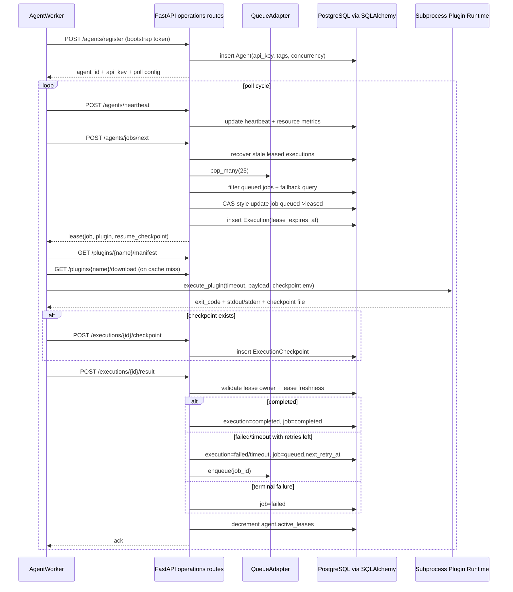

# Execution Flow

## Summary
This flow is validated from `aurora_agent.worker`, `aurora_agent.client`, and `aurora_core.routes.operations`. It captures registration, lease acquisition, plugin execution, checkpointing, and result finalization.

## Invariants
- A result is accepted only for matching `execution_id`, owning agent, and non-expired lease.
- Job retry scheduling is controlled by `attempt_count < max_attempts` and `next_retry_at`.
- Checkpoints are append-only snapshots tied to execution id.
- Queue membership is advisory; DB job status is the source of truth for eligibility.

## Risk Signals
- Bottleneck: lease issuance path (`/agents/jobs/next`) does stale recovery + candidate filtering + CAS update.
- Fan-out risk: result submission mutates execution, job, agent counters, and queue state.
- Critical synchronous path: subprocess execution is off-core, but completion handling is synchronous and transaction-sensitive.
- Circular risk: no direct runtime cycle, but repeated queue re-enqueue + stale recovery loops can amplify churn under persistent failures.
