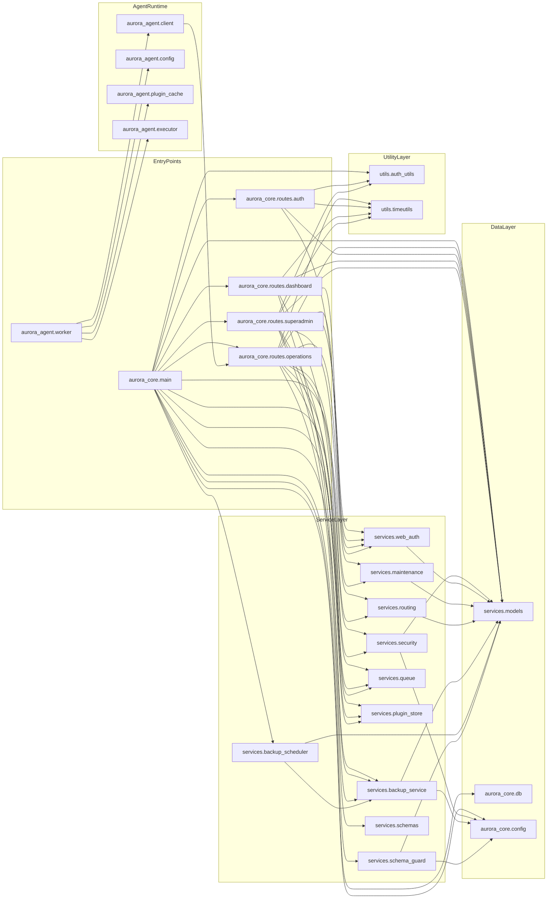

# Import Graph

## Summary
This graph captures the layered module topology validated from `aurora_core` and `aurora_agent` imports. It is intentionally compressed into domain layers to keep dependency reasoning tractable.

## Invariants
- Route modules depend on service/data/util layers, not on other route modules.
- Service layer is the only layer that should encode orchestration policy and side effects.
- `services.models` is the shared persistence contract for core runtime.
- `aurora_agent` runtime depends on HTTP API contract, not direct DB/model imports.

## Risk Signals
- Bottleneck: `aurora_core.routes.operations` is a high fan-in/fan-out orchestration hub.
- Fan-out risk: `aurora_core.main` wires many services and routers; startup failures can cascade.
- Circular dependency risk: currently low in code imports, but route-service coupling is dense around `web_auth` and audit paths.
- Critical synchronous path: `operations` route handlers perform sequential DB + queue + plugin metadata operations on request path.
