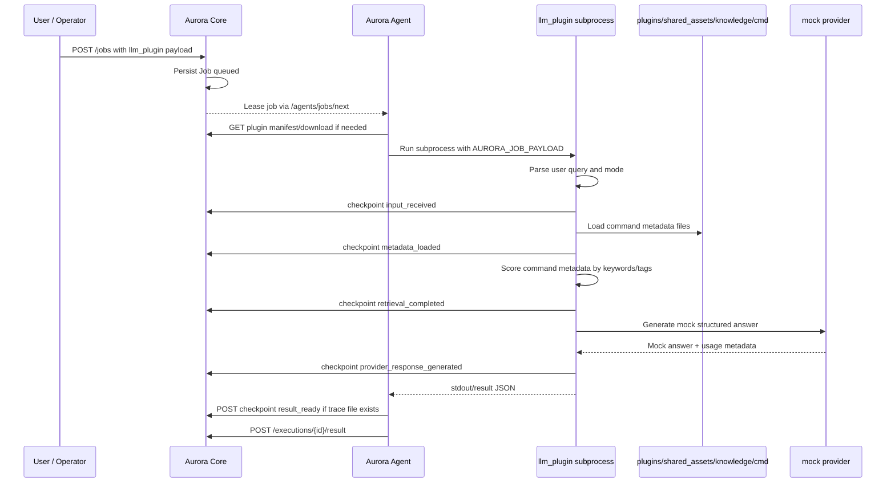
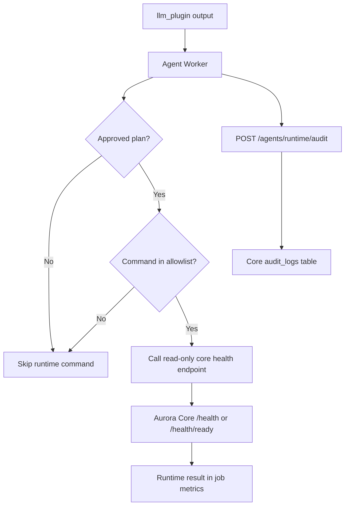
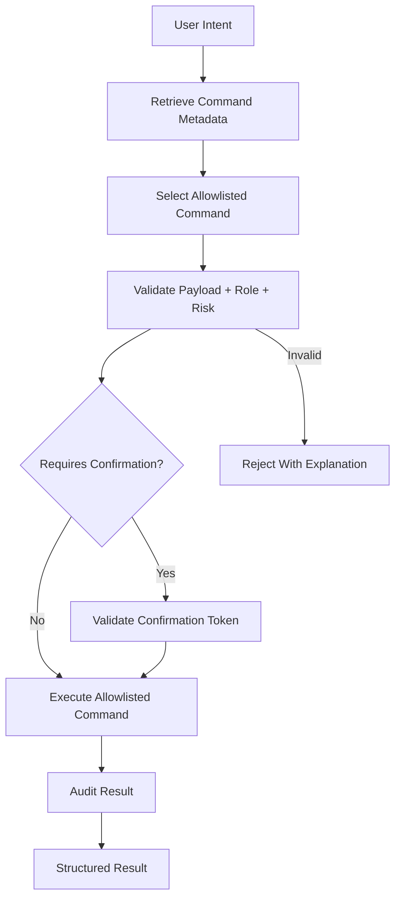
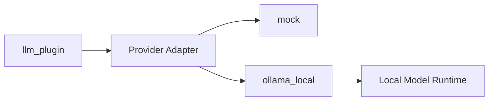

# LLM Execution Flow

## Summary

This graph describes the Aurora LLM plugin flow. The core prototype uses a mock provider and command metadata retrieval. Ollama local provider support is available in beta, and a read-only allowlisted runtime path exists for health checks.

## Invariants

- Core schedules and observes; it does not call LLM providers.
- Agent executes plugin subprocesses; it does not read Core DB internals.
- Prototype provider is mock and has zero cost.
- Work trace is exposed through checkpoints, not hidden reasoning.
- Command metadata retrieval is local and deterministic for prototype.

## Risk Controls

- No destructive command execution through the LLM runtime path.
- Read-only runtime commands are limited to an explicit allowlist.
- Runtime execution is disabled by default and must be feature-flagged.
- No external provider dependency in prototype.
- No vector database in prototype.
- Provider adapters stay plugin-local.
- Raw prompt and secrets are not stored by default.

## Runtime Beta Flow

Current allowlist:

- `health.ready`
- `health.live`
- `dashboard.overview`

## Future Command Execution Flow

Execution must remain metadata-driven and audited. Free-form generated shell text must not be executed.

## Beta Extension

Beta adds `ollama_local` without changing Aurora Core scheduling behavior.
