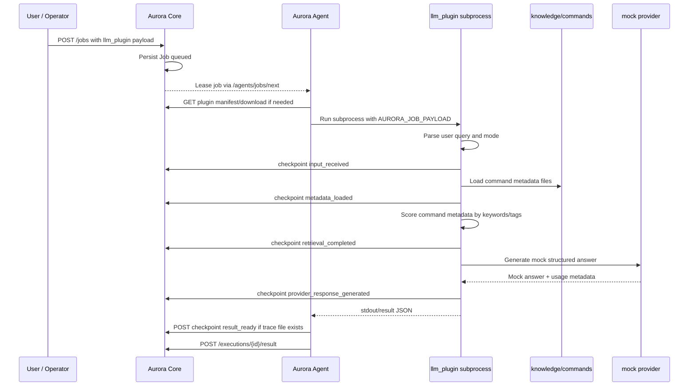
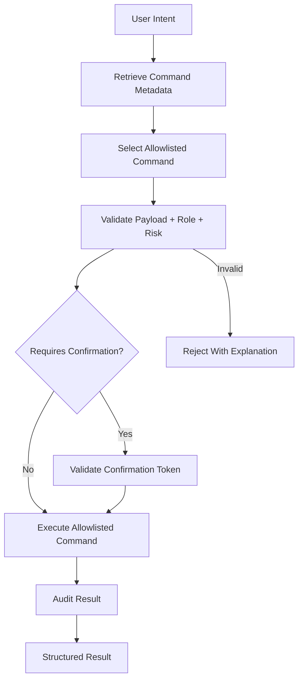
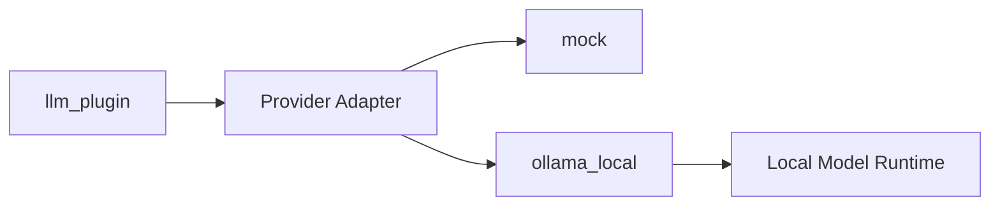

# LLM Execution Flow

## Summary

This graph describes the planned Aurora LLM plugin prototype. The first version uses a mock provider and command metadata retrieval only. Ollama local provider support is reserved for beta.

## Invariants

- Core schedules and observes; it does not call LLM providers.
- Agent executes plugin subprocesses; it does not read Core DB internals.
- Prototype provider is mock and has zero cost.
- Work trace is exposed through checkpoints, not hidden reasoning.
- Command metadata retrieval is local and deterministic for prototype.

## Risk Controls

- No destructive command execution in prototype.
- No runtime command execution in prototype.
- No external provider dependency in prototype.
- No vector database in prototype.
- Provider adapters stay plugin-local.
- Raw prompt and secrets are not stored by default.

## Future Command Execution Flow

Execution must be metadata-driven and audited. Free-form generated shell text must not be executed.

## Beta Extension

Beta adds `ollama_local` without changing Aurora Core scheduling behavior.
