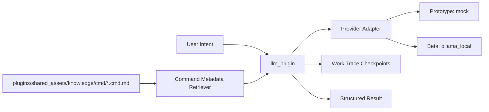

# Aurora LLM Concept

## Purpose

The Aurora LLM track adds a language-capable plugin class for command understanding, retrieval, explanation, and guided operations. The first prototype uses a mock provider only. Ollama local support is planned for beta.

Aurora remains the orchestrator. LLM behavior stays inside plugin subprocesses so Core does not become a provider-specific LLM application.

## Goals

- Read shared command metadata from repository files.
- Retrieve relevant commands from user intent.
- Produce structured responses that explain matched commands, endpoint options, assumptions, and safe next steps.
- Emit visible work-trace checkpoints so operators can see what the plugin is doing.
- Keep provider choice isolated behind plugin-side adapters.

## Non-Goals

- No paid provider dependency for prototype.
- No external vector database for prototype.
- No direct agent access to Aurora Core database internals.
- No hidden chain-of-thought exposure.
- No unrestricted runtime command execution in prototype; read-only allowlisted health checks are enabled behind a feature flag in beta.
- No automatic destructive action execution in any phase.

## Naming

- Track: Aurora LLM Track
- Plugin: `llm_plugin`
- Prototype provider: `mock`
- Beta provider: `ollama_local`
- Shared command metadata directory: `plugins/shared_assets/knowledge/cmd/`
- Plugin-local knowledge directory: `plugins/LLM/knowledge/cmd/`

## Capability Model



## Work Trace

The plugin should expose what it is doing through checkpoints, not through raw model reasoning.

Example:

```json
{
  "stage": "retrieval",
  "message": "Matched command metadata for backup restore and health readiness",
  "artifacts": ["backup_restore.cmd.md", "health_ready.cmd.md"],
  "confidence": 0.82
}
```

Allowed trace fields:
- `stage`
- `message`
- `artifacts`
- `confidence`
- `selected_commands`
- `assumptions`
- `next_action`

Forbidden trace fields:
- secrets
- raw hidden reasoning
- raw provider credentials
- sensitive prompt text unless explicitly enabled

## Prototype Scope

- Parse command metadata files.
- Retrieve by keyword/tag scoring.
- Use mock provider response generation.
- Emit work trace checkpoints.
- Return structured JSON result.

## Beta Scope

- Add `ollama_local` provider adapter.
- Keep mock provider as test default.
- Add local model settings and timeout controls.
- Add usage metadata for local model calls where available.

## Future Runtime Command Execution

Runtime command execution is a future capability, not part of the prototype.

The intended progression is:

- Prototype: suggest commands only.
- Beta: prepare command plans only.
- Future controlled execution: execute only allowlisted commands with explicit permission and audit logging.

Required execution gates:

- command is present in `plugins/shared_assets/knowledge/cmd/`
- command metadata marks it as executable
- command risk level is evaluated
- user/session has required role
- destructive commands require confirmation token
- payload is validated against command metadata
- execution is audited with `request_id`, actor, command name, and result
- command output is bounded and redacted

Runtime execution must remain outside Aurora Core's generic orchestration logic unless a clear, tested command-execution service boundary is added. The LLM should never execute commands directly from free-form generated text.

Current read-only runtime allowlist:

- `health.ready`
- `health.live`
- `dashboard.overview`
